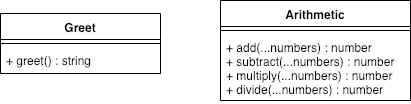

 LAB 01 DEMO
==============================================

## LAB 01

### Author: Vinicio Sanchez

### Links and Resources
* [repo](https://github.com/vladimirsan/401n12-lab0)
* [travis](https://travis-ci.com/vladimirsan/401n12-lab0)
* [back-end](https://lab0-401n12.herokuapp.com/)

### Modules
#### `greet.js`
##### Exported Values and Methods

###### `greet() -> string`

#### `arithmetic.js`
##### Exported Values and Methods

###### `add(...numbers) -> number`
###### `subtract(...numbers) -> number`
###### `multiply(...numbers) -> number`
###### `divide(...numbers) -> number`

#### Tests
* To run tests, please use the `npm run test` command.

#### UML

